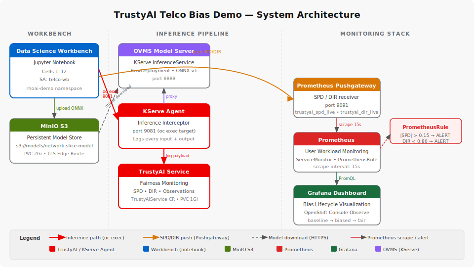
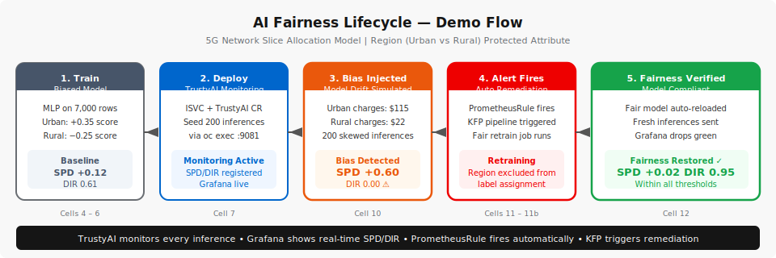
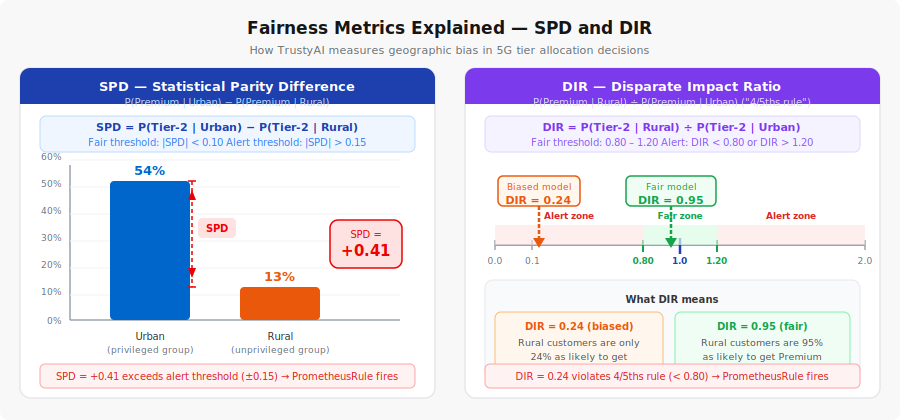

# TrustyAI Telco Bias Demo

> **Can your AI prove it treats every customer fairly?**
> This demo shows how a 5G network slice allocation model silently learns to discriminate against rural customers — and how TrustyAI catches it, alerts on it, and triggers automated remediation before regulators do.



---

## The Business Problem

A telecom company deploys an ML model to automatically assign customers to 5G network service tiers:

| Tier | Name | Service Level |
|------|------|--------------|
| Tier 2 | Premium | High-speed, low-latency, enterprise-grade |
| Tier 1 | Standard | Moderate speed |
| Tier 0 | Basic | Best-effort, lowest priority |

The model was trained on historical data where Urban customers had always received better service than Rural customers. It learned this pattern and began systematically assigning Rural customers to lower tiers — not based on their contract value or charges, **but on geography (Region)**, a protected attribute under FCC/Ofcom non-discrimination rules.

The model never explicitly uses a rule like "if Rural → lower tier." It learned the association from training data. **Without monitoring tools like TrustyAI, this bias is completely invisible.**

---

## What This Demo Shows



1. **Train a biased model** — an MLP trained on data where Urban customers had a built-in scoring advantage
2. **Deploy with TrustyAI monitoring** — every inference is logged and fairness metrics computed
3. **Inject additional bias** — simulate real-world model drift where rural customers get systematically worse outcomes
4. **TrustyAI detects it** — SPD and DIR metrics cross alert thresholds, a PrometheusRule fires
5. **Grafana shows the spike** — live dashboard shows bias lifecycle: baseline → biased → fair
6. **Retrain to fix it** — KFP pipeline or local retrain with bias-free training data
7. **Verify fairness restored** — metrics return to safe thresholds, Grafana confirms

---

## Fairness Metrics



| Metric | Formula | Threshold | Meaning |
|--------|---------|-----------|---------|
| **SPD** — Statistical Parity Difference | P(Premium\|Urban) − P(Premium\|Rural) | \|SPD\| < 0.10 | Gap in Premium allocation rates between groups |
| **DIR** — Disparate Impact Ratio | P(Premium\|Rural) / P(Premium\|Urban) | 0.80 – 1.20 | Ratio of favorable outcomes (the "4/5ths rule") |

---

## Demo Results

| Stage | SPD | DIR | Status |
|-------|-----|-----|--------|
| Baseline | +0.12 | 0.61 | Model has inherent bias from training data |
| After bias injection | +0.60 | 0.00 | Alert fires — geographic discrimination detected |
| After retraining | +0.02 | 0.95 | Fairness restored |

---

## Architecture

```
Workbench Notebook
       |
       |-- Trains MLP model (scikit-learn → ONNX)
       |-- Uploads to MinIO S3
       |
       v
  MinIO S3 (persistent model storage)
       |
       v
  KServe InferenceService (OVMS)
       |
  KServe Agent (port 9081)  <---- intercepts every inference
       |
       +----> OVMS Model Server (port 8888)
       |
       +----> TrustyAI Service
                   |
                   v
           Prometheus Pushgateway  <-- notebook pushes computed SPD/DIR
                   |
                   v
              Prometheus (user workload monitoring)
                   |
                   v
           Grafana Dashboard (OpenShift Console)
           + PrometheusRule (fires bias alert)
```

| Component | Version / Details |
|-----------|------------------|
| Red Hat OpenShift AI | 2.x and 3.x (**validated on 2.25 and 3.3**) |
| TrustyAI | TrustyAIService CR (PVC storage) |
| Model Server | KServe RawDeployment + OVMS |
| Model Format | ONNX (MLP classifier, FP32 output) |
| Object Storage | MinIO (Deployment + PVC) |
| Pipelines | KFP v2 via Data Science Pipelines (DSPA) |
| Namespace | `telco-bias-demo` |

---

## Repository Structure

```
trustyai-telco-demos/                              # repo root
├── shared/
│   ├── cluster-admin-setup.sh                     # Common cluster-admin commands (run once)
│   ├── patch-kserve.py                            # inferenceservice-config CA bundle patch
│   └── user-workload-monitoring.yaml              # Enables Prometheus user workload monitoring
│
└── bias-detection/                                # this demo
    ├── README.md                                  # This file
    ├── notebooks/
    │   ├── trustyai-network-slice-bias-rhoai-3.3.ipynb   # Main demo notebook (RHOAI 3.3)
    │   └── trustyai-network-slice-bias-rhoai-2.25.ipynb  # Validated reference (RHOAI 2.25)
    ├── docs/
    │   ├── business-use-case.md
    │   ├── trustyai-value-proposition.md
    │   ├── architecture.md
    │   ├── demo-walkthrough.md
    │   └── prerequisites.md
    ├── setup/
    │   └── grafana-bias-dashboard.yaml            # Bias-specific Grafana dashboard
    └── assets/diagrams/
        ├── architecture.svg
        ├── demo-flow.svg
        └── spd-dir-explainer.svg
```

---

## Quick Start

### 1. Cluster-Admin Setup (run once)

```bash
# From repo root
bash shared/cluster-admin-setup.sh

# Patch KServe for CA bundle (requires cluster-admin on redhat-ods-applications)
python3 shared/patch-kserve.py
```

See [docs/prerequisites.md](docs/prerequisites.md) for full details.

### 2. Open the Notebook

In Red Hat OpenShift AI:
1. Create a workbench named `telco-wb` in project `rhoai-demo`
2. Upload `notebooks/trustyai-network-slice-bias-rhoai-3.3.ipynb`
3. Run cells top to bottom

### 3. Run the Demo

| Cell | Action |
|------|--------|
| 1 | Deploy infrastructure (MinIO, ServingRuntime, TLS route, patch) |
| 2 | Install Python dependencies |
| 3 | Configuration (re-run after kernel restart) |
| 4 | Generate 7,000-row biased dataset |
| 5 | Train MLP + export ONNX |
| 6 | Upload model to MinIO |
| 7 | Deploy TrustyAI → ISVC → seed 200 inferences |
| 8 | Deploy Prometheus Pushgateway |
| 8b | Apply Grafana dashboard + user workload monitoring |
| 9 | Register SPD/DIR monitors + push baseline to Grafana |
| 10 | Simulate bias (oc exec skewed batch) |
| 11 | Check SPD/DIR — alert threshold exceeded, push to Grafana |
| 11a/b | Retrain via KFP pipeline or locally |
| 12 | Verify SPD/DIR reduced — push fair values to Grafana |

---

## Documentation

| Document | Audience | Description |
|----------|----------|-------------|
| [Business Use Case](docs/business-use-case.md) | Executives, customers | Business problem, regulatory risk, industry impact |
| [TrustyAI Value Proposition](docs/trustyai-value-proposition.md) | Decision makers, architects | Why TrustyAI, what it uniquely provides |
| [Architecture](docs/architecture.md) | Engineers, architects | Technical deep-dive, component interactions |
| [Demo Walkthrough](docs/demo-walkthrough.md) | Demo presenters, SAs | Step-by-step presenter script |
| [Prerequisites](docs/prerequisites.md) | Engineers | Complete setup guide before running demo |


---

## Key Technical Details

**Why `oc exec` instead of external inference URL?**
The KServe InferenceService in RawDeployment mode does not expose an external route in all environments. Inferences are sent via `oc exec` into the predictor pod, calling `localhost:9081` (the KServe agent). The agent intercepts the request, proxies it to the OVMS model, and logs the payload to TrustyAI — this is the only reliable path for TrustyAI to receive inference data.

**Why Prometheus Pushgateway?**
SPD and DIR are computed directly from model predictions in the notebook and pushed to a Prometheus Pushgateway, which is scraped by Prometheus. Grafana reads from Pushgateway metrics (`trustyai_spd_live`, `trustyai_dir_live`) to display real-time bias values across the full lifecycle — baseline, biased, and fair — as labeled time series.

**Why ONNX with ArgMax + Cast(FP32)?**
scikit-learn's ONNX export produces a `ZipMap` node (outputs a dict) which is incompatible with OVMS and TrustyAI's payload reconciler. The ZipMap is stripped and replaced with `ArgMax → Cast(FP32)` to produce a single FP32 scalar output that both OVMS and TrustyAI can handle correctly.

---

## References

- [TrustyAI Documentation](https://trustyai.org/docs/main/main)
- [Red Hat OpenShift AI Documentation](https://docs.redhat.com/en/documentation/red_hat_openshift_ai_self-managed)
- [KServe Documentation](https://kserve.github.io/website/)
- [EU AI Act — High-Risk AI Systems](https://artificialintelligenceact.eu/)
